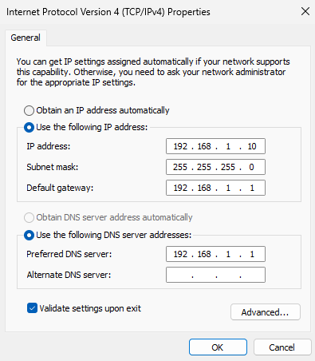
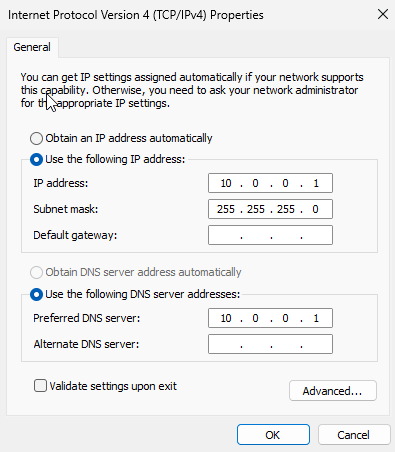
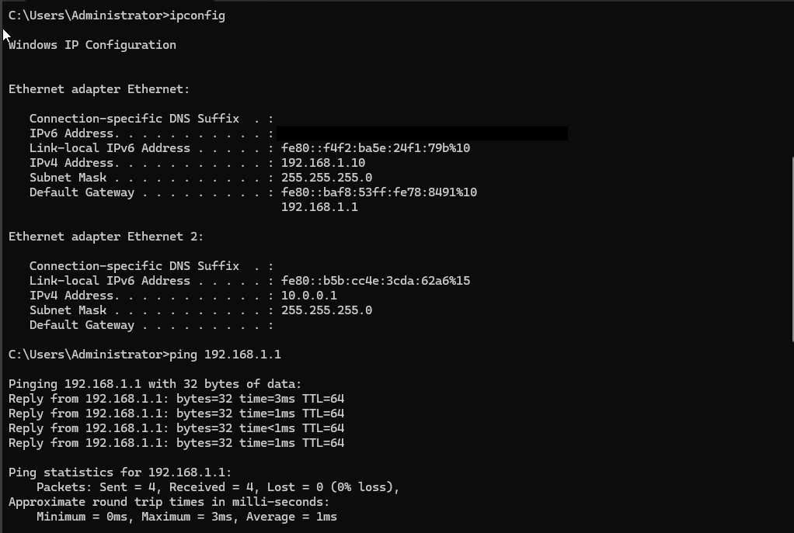
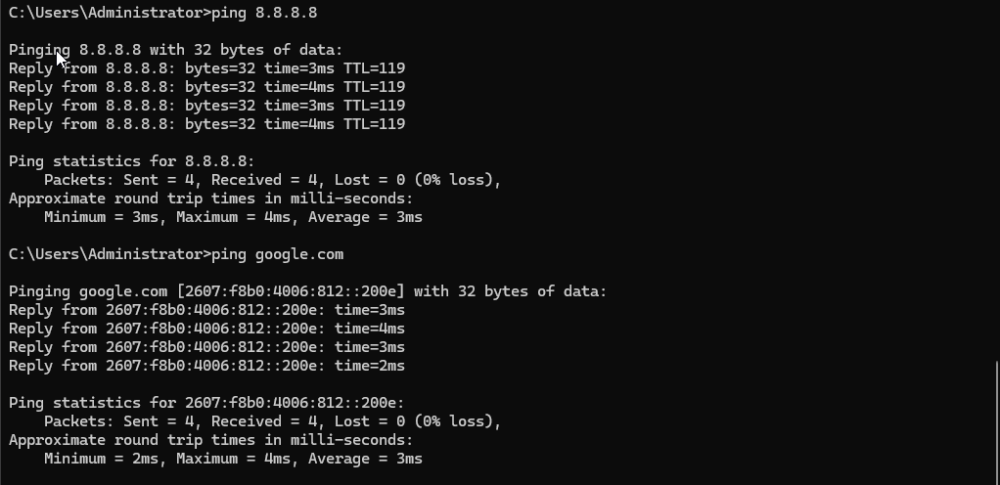

# ⚙️ Windows Server Configuration

### Initial Setup

The virtual machine for the Windows Server was created and the ISO file was mounted and installed. 
- 64 GB virtual storage
- 2 CPU cores
- 4.15 GB of RAM

---

## 🖧 Network Configuration

The bridged and internal network adapters were configured with static IP addresses. The DNS of both adapters use the servers own internal IP. The bridged interface provides network connectivity while the internal interface is used for Active Directory and DNS.

The commands `ping` and `ipconfig` were utilized to test and verify successful IP configuration, DNS resolution, and gateway reachability.

## Server Roles 

The selected server roles were added along with the accompanying features and supplementary roles required for their functionality.

