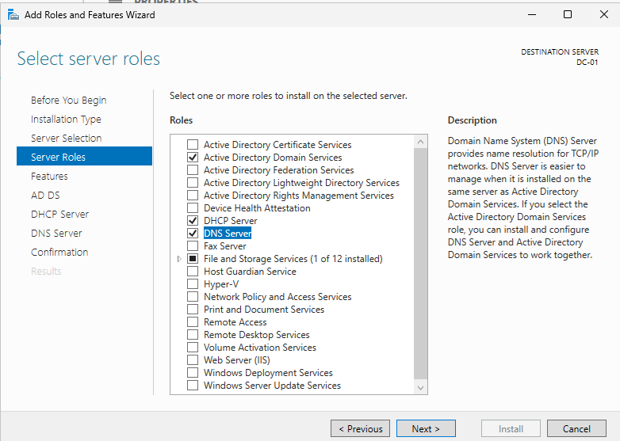
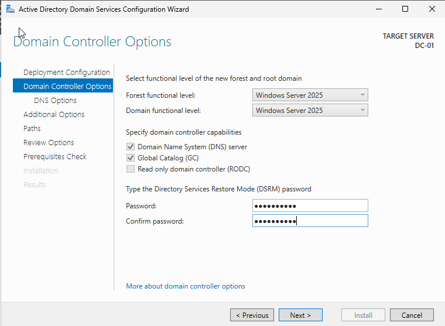
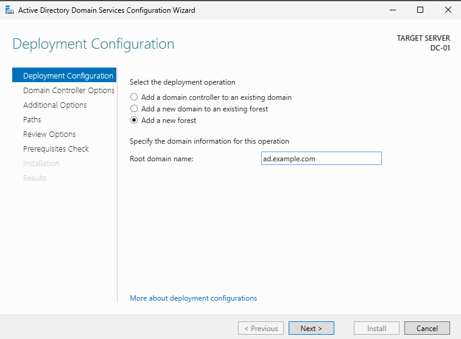
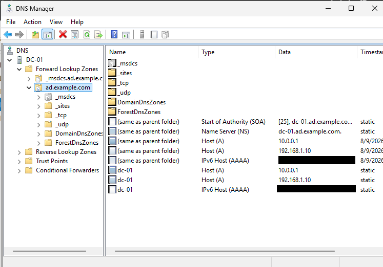
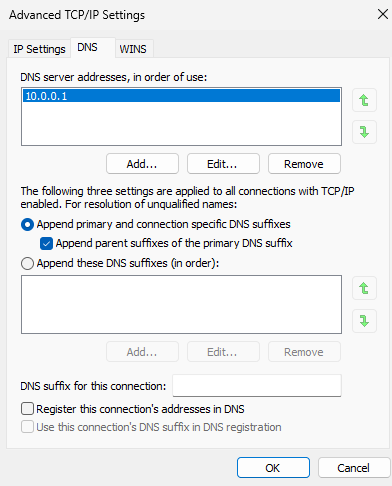
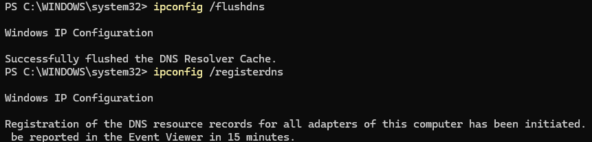
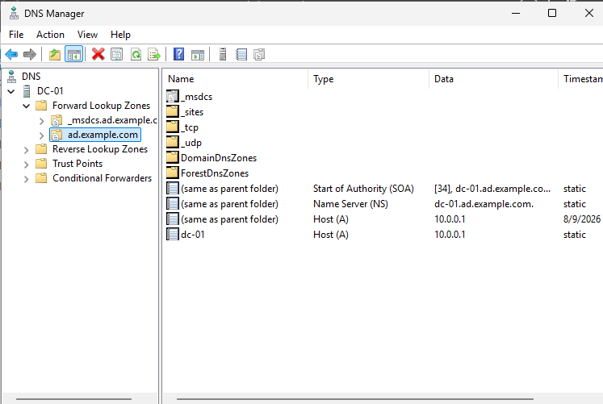
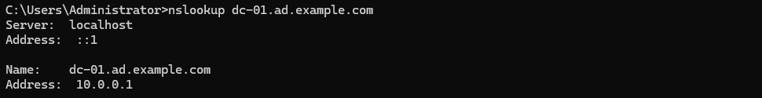
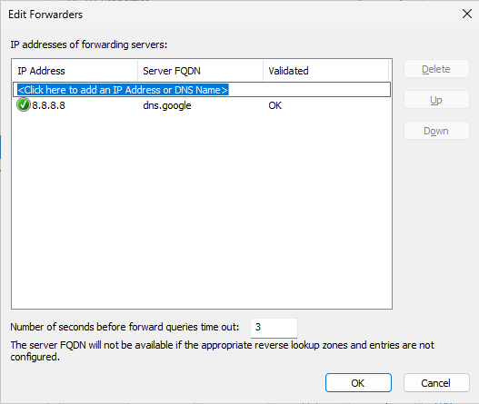
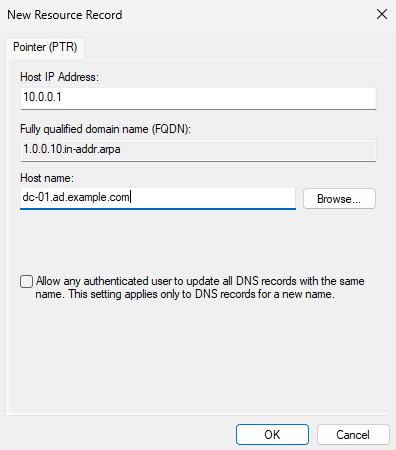

# ⚙️ Windows Server Configuration

### Initial Setup

The virtual machine for the Windows Server was created and the ISO file was mounted and installed. 
- 64 GB virtual storage
- 2 CPU cores
- 4.15 GB of RAM

---

## 🖧 Network Configuration

The bridged and internal network adapters were configured with static IP addresses. The DNS of both adapters use the servers own internal IP. The bridged interface provides network connectivity while the internal interface is used for Active Directory and DNS.

🖼️ DC-01 Network Configuration

The commands `ping` and `ipconfig` were utilized to test and verify successful IP configuration, DNS resolution, and gateway reachability.

🖼️ DC-01 Network Verification

---

## 🔨 Server Roles 

The selected server roles were added along with the accompanying features and supplementary roles required for their functionality.

## 🏢 Active Directory Domain Services Deployment

🖼️ Domain Controller

🖼️ Active Directory Domain Systems Deployment

- NetBIOS name was set: `AD`
- AD DS database, log, and SYSVOL paths were left as default
  
## 🌐 DNS 
After the Active Directory Domain Services were configured and installed, the system was restarted. In the DNS Manager, the zone for the domain is can be viewed and the name server record confirms the machine is hosting the zone. Then the DNS registration for the bridged adapter was removed and a series of commands were used to flush the DNS Resolver Cache and register the DNS resource records. 

🖼️ Active Directory DNS Zone

🖼️ Bridged Adapter DNS Removed

🖼️ DNS Resolver Flush and Resource Record Registration

🖼️ Active Directory DNS Zone

- An `nslookup` command confirms the DNS server can resolve its domain to the appropriate internal IP

- Google's public DNS server was set as a forwarder for queries outside the servers zones. This was then tested by disabling root hints and using nslookup to confirm external domains could still be resolved

- A pointer record was created to enable reverse DNS lookups with the server's IP and this was verified with an `nslookup` command

🖼️ Reverse Lookup

 

## 📡 DHCP
