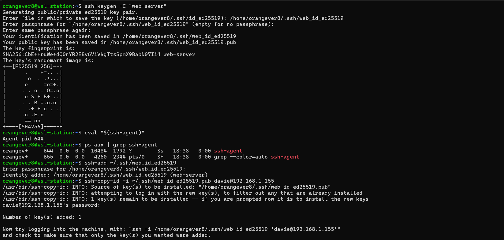
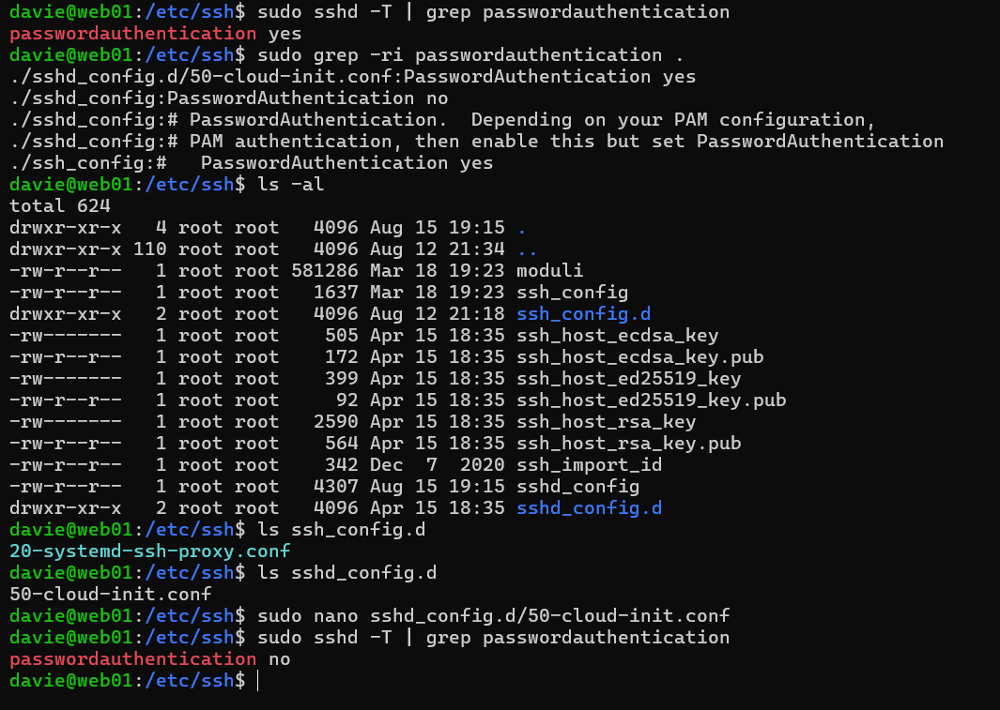

# 🔐 SSH
## Overview
In this segment of the lab there are two core machines. One named `wsl-station` on the host machine which uses SSH to configure the machine named `web01` beyond it's initial system setup.

---

## 🛡️ SSH Configuration

The OpenSSH Server was installed and enabled utilizing `apt` and `systemctl`. The service was confirmed to be enabled and active prior to the establishment of the initial SSH connection.

- A key pair was then created from the host, `wsl-station` and cached so that the passphrase and custom file name would not have to be re-entered for the duration of the session
- The public key was then sent to the web server using `ssh-copy-id`
- The SSH connection was tested again before any further configuration

- On the server in `/etc/ssh/sshd_config`, the port was altered to `15515` and the password functionality for SSH connections was disabled
- `systemctl restart ssh`, `systemctl restart ssh`, and `systemctl status` were used to ensure it did not fail
- Then a variety of commands were used to check for any files with conflicting password settings and those conflictions were rectified

📷 SSHD Configuration Verification

- A file `Config` was then created to simplify the SSH connection process as it included the custom SSH port, host IP of the web server and the user's name

