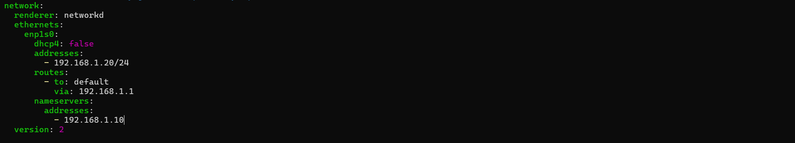
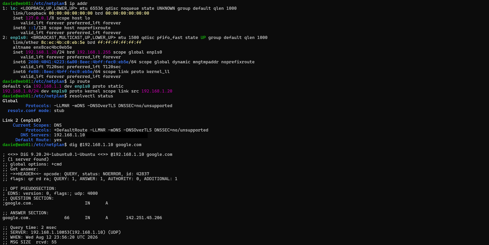

# 🌐 Network

## 🖧 Network Configuration

The **yaml** file in `/etc/netplan/` was accessed and the static IP, DNS from the Windows Server (DC-01), and default gateway were configured.



The following commands were then utilized to safely apply the changes without breaking the SSH connection being used before the correct configuration was established:
- ```sudo netplan try```
- ```sudo netplan apply```

---

## 📡 Network Connectivity Testing

- `ip addr` verified the static IP change
- `ip route` verified the default gateway was reachable
- `resolvectl status` and the `dig` command verified DNS configuration, reachability, and resolver functionality



SSH connection to server with new static IP


The `Config` file was updated with the new IP
