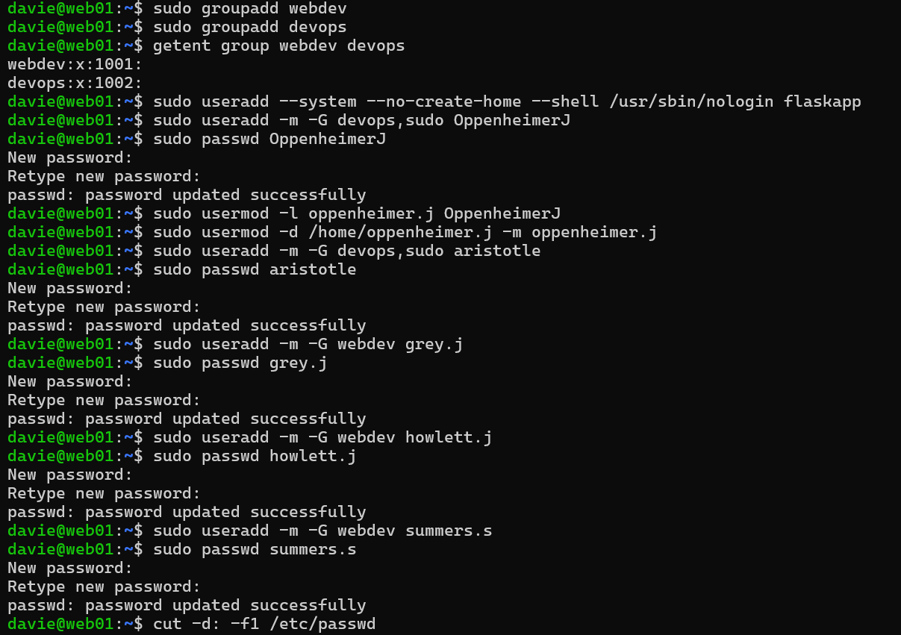
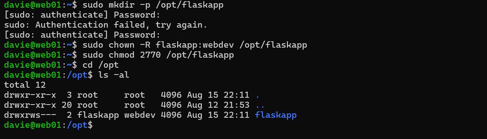

## 👥 User/Group Creation and Management
The following structure has been created in the Ubuntu Web Server and reflects the structure of the Active Directory IT organizational unit:
| Groups     | Users                           |
|------------|---------------------------------|
| **webdev** | grey.j<br>howlett.j<br>summers.s|
| **devops** | oppenheimer.j<br>aristotle      |
- The members of `devops` also have `sudo` perms
- The passwords and home directories were also created for these users
- The service account `flaskapp` was created without a home directory and cannot be logged into. The purpose being to run the application and ensure it has only the permissions that are necessary for its specific role.



The creation of these users and groups was verified with:
- ```cut -d: -f1 /etc/group```
- ```cut -d: -f1 /etc/passwd```

---

## 🗃️ File Permissions

- The directory `/opt/flaskapp` was created for the web application files
- The owner/group was set to flaskapp/webdev so that the developers can access the files while the flaskapp service account runs the application
- Permissions were set to 2770 so that only flaskapp and web developers have access permissions and the SGID is a precaution to ensure group inheritance
- 


